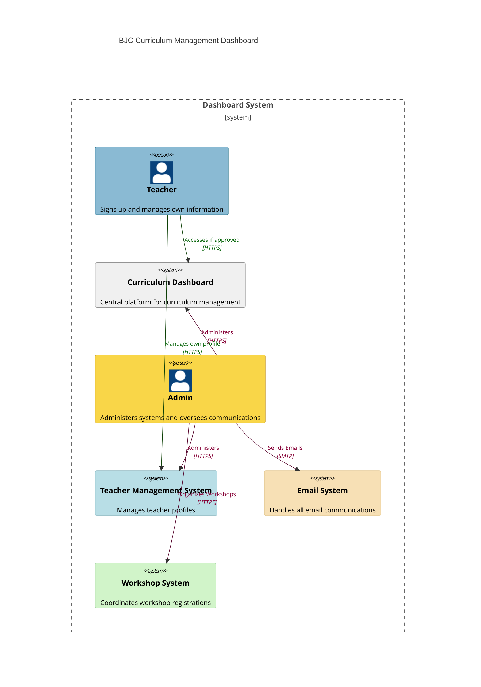

# BJC Teacher Tracker
Sp23 Badges:

[](http://dashboard.bluejay.governify.io/dashboard/script/dashboardLoader.js?dashboardURL=https://reporter.bluejay.governify.io/api/v4/dashboards/tpa-CS169L-23-GH-cs169_BJC-Teacher-Tracker/main) •
[](https://github.com/cs169/BJC-Teacher-Tracker-App/actions/workflows/specs.yml) •
[](https://github.com/cs169/BJC-Teacher-Tracker-App/actions/workflows/rubocop.yml) •
[](https://codeclimate.com/github/cs169/BJC-Teacher-Tracker/maintainability) •
[](https://codeclimate.com/github/cs169/BJC-Teacher-Tracker/test_coverage) •
[](https://www.pivotaltracker.com/n/projects/2406982)

---

@beautyjoy/BJC-Teacher-Tracker Status:

[](https://github.com/beautyjoy/BJC-Teacher-Tracker/actions/workflows/specs.yml) •
[](https://github.com/beautyjoy/BJC-Teacher-Tracker/actions/workflows/rubocop.yml) •
[](https://github.com/beautyjoy/BJC-Teacher-Tracker/actions/workflows/codeql-analysis.yml) •
[](https://codecov.io/gh/beautyjoy/BJC-Teacher-Tracker) •
[](https://codeclimate.com/github/beautyjoy/BJC-Teacher-Tracker/maintainability) •
[](https://codeclimate.com/github/beautyjoy/BJC-Teacher-Tracker/test_coverage)
---

## Description

The Beauty and Joy of Computing (BJC) is an introductory computer science curriculum developed at UC Berkeley meant for high school freshmen up to college freshmen. The program has a teacher guide and a newly generated password that is to be given to any teacher who signs up for the program as a volunteer educator in the Bay Area - there are plans to expand the program to other states in late 2020. This pilot application is designed as a dashboard to track the workflow of teachers who run the program and provide high-level, descriptive statistics on the courses taught and participating schools. The BJC Teacher Tracker is a NEW project started in Fall 2019 by a group of 5 student developers in UC Berkeley's CS 169: Software Engineering.

## Features


* Teachers can sign up at https://teachers.bjc.berkeley.edu
  * For homeschoolers, they need to upload additional support documents.
* Admins can log in to approve, deny, or request more information for each request.
* Admins can merge duplicate teacher records.
* Admins can create and modify workshops and relevant registrations.
* Admins can see a dashboard of teacher stats.
* Teachers can log in to view protected solutions content.
* Admins can create and modify email templates.


## Installation:

### Environmental Variable
* We are not using `application.yml` (rails env framework). Instead, we use a `.env` file at directory root to load all env vars. Use `.env.example` as a reference for env format.
* Use tools like [overmind](https://github.com/DarthSim/overmind) or [foreman](https://github.com/ddollar/foreman) to load in the env vars.
* You probably need to configure your own oauth keys and database name/passwords.

### Postgres Installation

#### MacOS:
* `brew install postgresql chromedriver`
* Start postgres if necessary. `brew services start postgresql`

#### Linux/WSL:
* `sudo apt install postgresql`
* Create a postgres user.
  * `sudo su - postgres` (to get into postgres shell)
  * `createuser --interactive --pwprompt` (in postgres shell)
  * Save `DB_USER` and `DB_PASSWORD` fields in the `.env` file.
* Start postgres if necessary. `pg_ctlcluster 12 main start`
  * Note: if you are using WSL2 on windows, the command to start postgres is `sudo service postgresql start`

### Framework/Gem Installation
* `rvm use 3.2.3` # Double-check `.ruby-version`
* `bundle`
* `bin/rails db:setup` (Run this after setting up Postgres)
* `nvm install 14` Node v14 is needed
* `yarn install` Yarn is needed

### Spin Up Server
* Use tools like [overmind](https://github.com/DarthSim/overmind) or [foreman](https://github.com/ddollar/foreman) to boot up server with env vars loaded.
* If you are using `overmind`, you can simply `npm run dev`.

### Available Commands
- For RSpec tests run `bundle exec rspec`
- For Cucumber tests run `bundle exec cucumber`
- For Rubocop check run `bundle exec rubocop` (Autocorrect all with `bundle exec rubocop -a`)
- To make someone an admin use db console access
  - Using psql
    - First run `heroku pg:psql` (for Heroku) or `psql bjc_teachers_dev` (for local) to get into psql
    - Alternatively, you can use `rails db` to get into psql
    - Then
      ```
      UPDATE teachers
      SET admin = true
      WHERE Email LIKE '%@berkeley.edu%'
      ;
      ```
      Of course, you can swap in the email of your choice.
  - Using rails console
    - First run `heroku run rails console` (for Heroku) or `rails console` (for local) to get into rails console
    - Then
      ```
      Teacher.where("email LIKE '%@berkeley.edu%'").update_all(admin: true)
      ```

## JavaScript and CSS with Webpack

* `stylesheet_pack_tag` doesn't work. :(
* Use `import '*.scss' in a _JavaScript file, and webpack will compile correctly
* If you need a new CSS-only import, make a new CSS *and* a new JS file.

## Deployed Site:

- https://teachers.bjc.berkeley.edu

## Steps to Deploying on Heroku

- ... create a heroku app, the default heroku-22 stack should work.
- `heroku buildpacks:set heroku/nodejs` # this must be the first buildpack.
- `heroku buildpacks:add --index 2 heroku/ruby`
- `heroku addons:create heroku-postgresql`
- `heroku git -a [app-name]`
- Make your local changes and start the commit process
- `git add .`
- `git commit -m "<Message>"`
- `git push heroku master` (If this fails, try commenting the release command in `Procfile` for this first deployment only and go on to the next step. After you are done with the deployment, uncomment back the release command again. For more information, see [this PR](https://github.com/cs169/BJC-Teacher-Tracker/pull/15).)

If bundler install runs successfully, continue with the following commands to correctly setup the PostgreSQL database on Heroku:

- `heroku run bin/rails db:drop` (if this fails, you can skip this step)
- `heroku run bin/rails db:schema:load`
- `heroku run bin/rails db:seed`
- `heroku config:set ...` for each of the environment variables.
- `heroku open`


### CodeClimate Local Test

TODO: Link to download CodeClimate binaries for macOS.

```
https://codeclimate.com/downloads/test-reporter/test-reporter-latest-darwin-amd64
```
